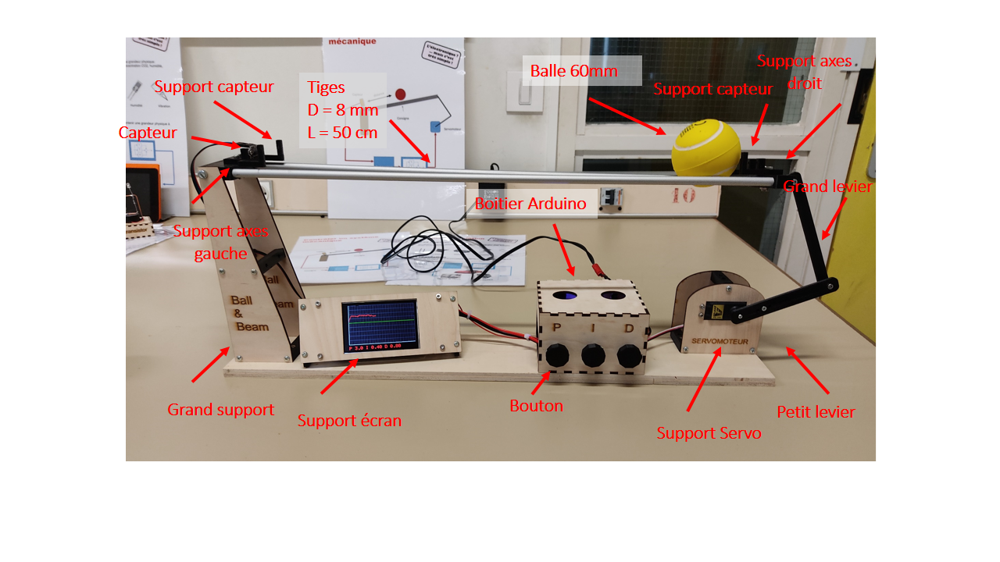
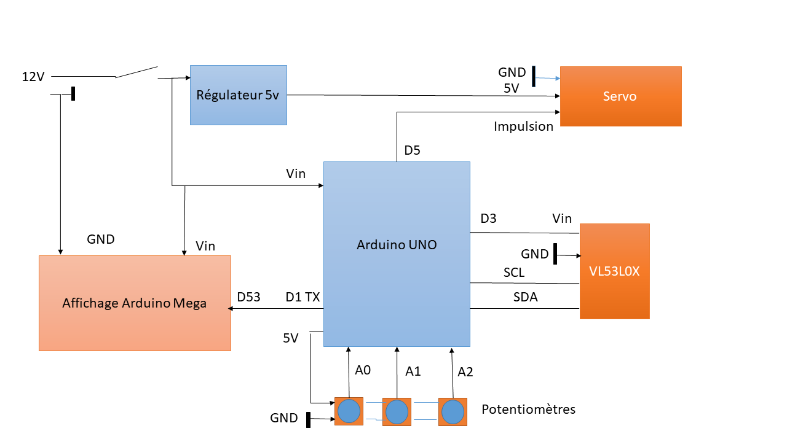
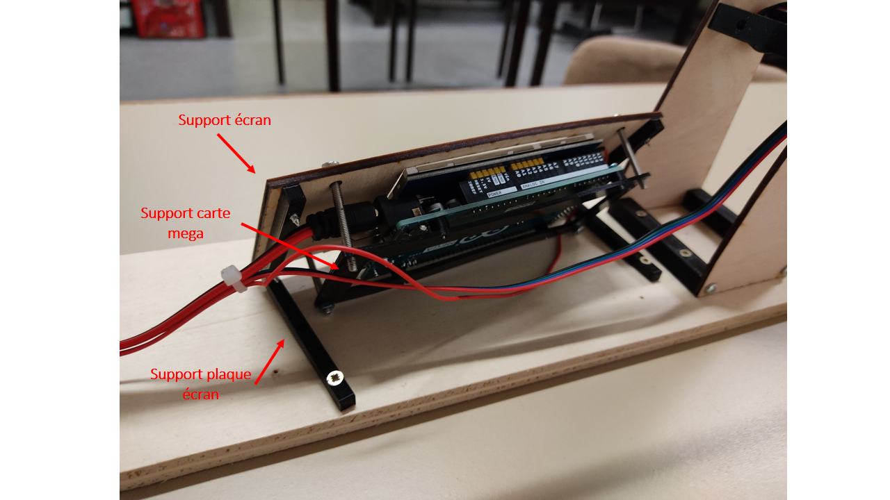

# Asservissement d'une balle sur un plan incliné
Ce dépôt fournit les fichiers permettant de réaliser l'asservissement d'une balle sur un plan incliné en utilisant un corecteur PID. 

## Principe
La balle roule sur deux axes en aluminium dont l'inclinaison est réglée par un système de leviers relié à un servomoteur standard. La position de la balle est déterminée par un capteur de distance VL53L0X, que l'on peut trouver monté sur une carte par exemple [ici](https://www.amazon.fr/gp/product/B086TSKJBT/ref=ppx_yo_dt_b_search_asin_title?ie=UTF8&psc=1). 

L'asservissement est réalisé par un Arduino Uno. L'affichage graphique est réalisé au moyen d'un arduino Mega et d'un afficheur graphique. Les deux cartes Arduino communiquent par un lien série.

## Câblage
Les différents circuits sont interconnectés selon le tableau suivant.

| PIN Arduino | Description     |
| ----------- | --------------  |
| D5           | Impulsion servo|
| A0          | Potentiomètre 0 |
| A1          | Potentiomètre 1 |
| A2          | Potentiomètre 2 |
| D3          | Alim VL53L0X |
|SCL          | SCL VL53L0X |
|SDA           | SDA VL53L0X |
| D1 TX| lien série, connecté au OIN D53 de l'arduino Mega |

La figure ci-desous donne le détail du cablage.

## Mécanique

La mécanique est réalisée en découpe et gravure laser dans du contreplaqué 3mm et en impression 3D.

Les pièces dont décrites ici:

|Pièces | Fichiers source (conception)    | Fichiers de fabrication | Nombre d'exemplaires |
| ----------- | --------------  | -------- |  -------- |
|Boitier arduino          | boitier.lbrn2| boitier.dxf | 1 |
| Support servo       | supservo.lbrn2 | supservo.dxf | 1 |
| Support écran          | supecran.lbrn2 | supecran.dxf | 1|
| Support  gauche          | grandsupport.lbrn2 | grandsupport.dxf | 1|
| Support axes droit          | supaxedroit.scad | supaxedroit.stl | 1|
| Support axe gauche          | supaxegauche.scad | supaxegauche.stl | 1 |
|petit levier           | levier.scad | petitlevier.stl | 1|
|grand levier           | levier.scad | grandlevier.stl | 1 |
|Support carte Mega      | megasupport.scad | megasupport.stl | 1 |
|Support plaque écran      | msupplaqueecrant.scad | supplaqueecran.stl | 2 \
|Support capteur      | supcapt.scad | supcapt.stl | 2 
| entretoise 62       |entretoises.scad | entretoise62.stl |4|
| entretoise 40       |entretoises.scad | entretoise40.stl |3|

Les fichiers dxf sont destiné à une découpe laser (contreplaqué 3mm). Les fichiers dxf à une impression 3D.

Les pièces sont indiquées sur la photo en haut de page. La photo ci-dessous donne un détail sur l'écran.

